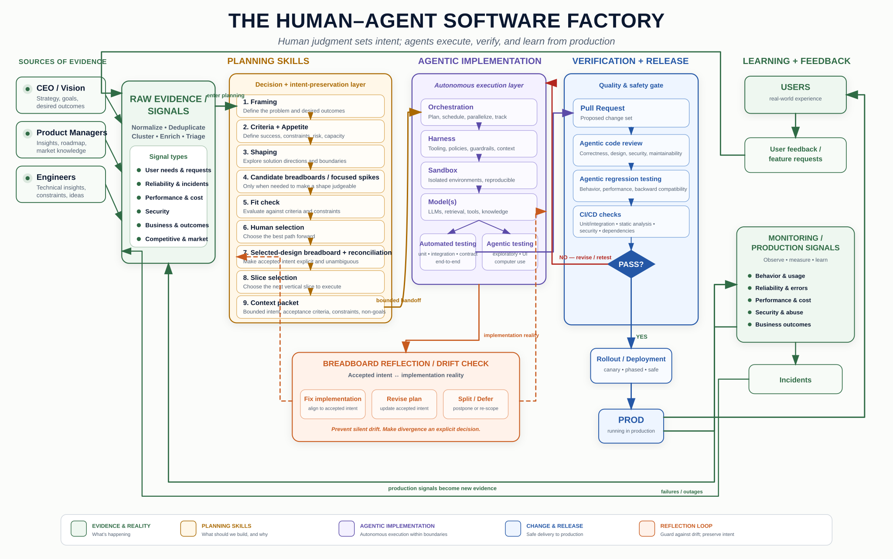

# Planning Skills for Agents and Humans

Turn a fuzzy feature into a selected, testable, vertically sliced implementation packet—without letting the agent invent scope.

These skills help product and engineering teams preserve intent from raw evidence through implementation. They are most useful for strategically important feature work with a bounded appetite, usually a 2–6 week bet for a small launch team.

**New here? Start with the [10-minute guide](./docs/start-here.md).**

## When should I use these skills?

You do not have to begin your idea inside this repo.

Start wherever it is easiest to think: a conversation, whiteboard, document, Claude Design, Codex, rough prototype, pile of notes, a set of requirements, or a solution already in your head.

Use these skills when the idea becomes important enough that you do not want its meaning to live only inside a conversation or disappear between prompts. This repo is the bridge between **playing with an idea** and **building it deliberately**.

That usually happens when:

- there are several plausible ways to solve the problem
- you already have a solution idea but do not yet know which needs or constraints it truly serves
- a prototype looks promising, but you do not yet understand how it should behave
- an agent is about to modify a real codebase
- the work will take days or weeks rather than minutes
- several people or agents need to share the same understanding
- important requirements, boundaries, or decisions could easily be forgotten
- you need to hand the work from exploration into implementation
- implementation may be drifting away from the original intent

### The core principle

> **Start where the useful thinking already is. Exploration is fluid. Commitment is gated.**

During collaborative shaping, you can start from requirements (**R-first**), a proposed solution (**S-first**), a prototype, current-system evidence, a fit question, or an unknown worth spiking.

Requirements, shapes, fit checks, focused spikes, sketches, and candidate breadboards may inform one another in any useful order while they remain working material:

```text
requirements (R) ↔ shapes (S) ↔ fit checks
      ↑                ↕             │
      └── discoveries ← spikes / candidate breadboards / sketches
```

What stays strict is promotion:

- working requirements must be accepted before they judge final selection
- Appetite and cut line must be accepted before shape selection
- a human explicitly selects the direction
- candidate evidence does not become selected-design intent without reconciliation
- selected-design intent is accepted before slicing
- a human-selected slice bounds implementation

If a team, CI harness, or multi-agent planner needs deterministic prerequisites, use the **gated/orchestrated profile** in `.agent-orchestration.yaml`. The formal route remains available; it is no longer the only legal order for exploration.

### It is a mode switch, not necessarily a tool switch

You can use the same agent for exploration, planning, and implementation. What changes is what you ask it to do:

- **Explore:** “Help me think through this idea. Show me possibilities.”
- **Shape collaboratively:** “Capture what I have, separate requirements from mechanisms, and move among R, S, fit, spikes, and candidate breadboards as useful. Do not select for me.”
- **Shape with strict gates:** “Use the gated profile and enforce each prerequisite before the next controlled step.”
- **Build:** “Implement only this selected slice. Preserve these requirements and verify it against the breadboard.”

A practical workflow is:

1. Start with whatever you actually have: R, S, evidence, or a prototype.
2. Use the smallest move that resolves the current uncertainty.
3. Let working R and S revise one another through fit checks, spikes, sketches, and candidate breadboards.
4. Accept requirements and Appetite when they are good enough to constrain a real decision.
5. Make the human decisions about direction and scope.
6. Reconcile the selected direction into accepted behavior.
7. Give the coding agent a bounded slice and compact context packet.
8. Check drift as implementation evolves.

For example, you might begin in Claude Design with a rough interface or in Claude Code with a solution idea. Capture that as candidate Shape A, extract provisional requirements from it, run a working fit check, spike the uncertain parts, breadboard only the behavior that is still hard to judge, then accept the judging criteria and Appetite before choosing a direction.

If you are using Claude Design together with the Planning Skills repository, see **[Using Claude Design with the Planning Skills Repository](./docs/claude-design-workflow.md)**.

You can also begin directly in Codex. For a small, obvious task, just make the change. For a larger or ambiguous task, tell Codex to use the relevant planning skill. You can choose collaborative shaping or the gated profile explicitly.

Do not add planning ceremony where it provides no value. A small copy change, contained bug fix, disposable experiment, low-risk script, or already-clear change may not need the full workflow.

> Use the smallest planning move that prevents an important misunderstanding.

### Use the skills in the repository where the product is being built

Install or reference these skills once, then open the product repository you are actually working on. The Planning Skills repository supplies the method and reusable instructions; project-specific frames, shaping decisions, breadboards, slices, and implementation packets should normally live beside the product code they govern.

Do not replace an existing project `AGENTS.md` with this repository's file. Prefer an installed plugin, point the agent at the relevant canonical `SKILL.md`, or selectively merge the planning rules that fit the project. Existing product-specific instructions remain authoritative for that codebase unless the team explicitly changes them.

See [Using Planning Skills in a product repository](./docs/using-in-a-product-repo.md) for the practical setup.

### Recommended project layout

A simple default is:

```text
planning/
  wayfinding/          # optional multi-session coordination maps and tickets
  frame.md
  shaping.md
  appetite.md          # optional when the appetite needs its own decision record
  candidate-A-breadboard.md  # optional exploratory evidence during shaping
  breadboard.md        # accepted selected-design intent
  sketch-reconciliation.md
  statechart.md
  slices.md
  interface-contracts.md
  executable-breadboard.md
  dumplink.md
  kickoff.md
  context-packet.md
  spikes/
  runs/
```

This is a convention, not a requirement. Keep one clearly active artifact for each authoritative planning level unless the project intentionally versions them. Candidate breadboards remain subordinate to their named candidate and shaping artifact. Preserve rejected alternatives in shaping, keep tables authoritative over generated diagrams, and treat run logs as audit records rather than product truth.

### Choose the handoff artifact by its job

| Artifact | Use it for |
| --- | --- |
| **Wayfinding map** | A low-resolution index of dependent planning questions across sessions. It coordinates work but never becomes product truth or an implementation backlog. |
| **Appetite card** | The fixed time budget, cut line, accepted uncertainty, and revisit conditions that selection must fit. |
| **Candidate-shape breadboard** | Exploratory evidence about one unselected shape when its behavior must be clarified. In collaborative mode it may use provisional judging inputs; it is never build scope. |
| **Selected-design breadboard** | Accepted normative behavior after human selection and explicit reconciliation. |
| **Kickoff document** | A durable, human-readable map of the shaped product territory. It is not the build sequence. |
| **Executable breadboard** | The behavioral and test contract for one selected slice. |
| **Dumplink plan** | A selected project decomposed into sequenced vertical task groups, with risk, dependencies, and appetite-based cuts. |
| **Context packet** | The exact subset of authoritative planning material handed to the active implementation agent. |

A common **controlled** path is: accepted criteria and Appetite → candidate shapes ↔ candidate breadboards or focused spikes when needed → human-selected shape and project boundary → accepted selected-design breadboard → optional Dumplink to create sequenced vertical task groups → human-selected active task group or other demoable slice → interface contracts and executable breadboard when needed → optional kickoff reference → context packet → implementation.

That path is useful for automation and teams that want stronger ceremony. Collaborative shaping may enter and move among R, S, fit, spikes, and candidate breadboards before those judging inputs are accepted. The same promotion gates apply before selection and build.

Set Appetite before selecting a shape. Use the `Appetite` section in the [shaping template](./templates/shaping.md) for a compact decision or the standalone [appetite card](./templates/appetite-card.md) when ownership, rationale, and revisit conditions need their own record.

An estimate is not a prediction made before the work. It is the output of preliminary design work.
First, decide how much the problem or opportunity is worth pursuing. That determines the time budget. Then dig into the problem, reduce the important unknowns, and shape a solution whose scope is commensurate with that budget.
You do not first estimate the ideal solution and then decide whether you can afford it. You decide what the opportunity is worth, then design the best solution that fits within that constraint.

## The core workflow

### Collaborative shaping loop

```text
start from R, S, evidence, prototype, fit question, or unknown
  ↕
requirements ↔ shapes ↔ fit checks
      ↕         ↕
  focused spikes / sketches / candidate breadboards
  ↕
accept requirements + Appetite when decision-ready
  → human selection
  → reconcile selected direction into selected-design behavior
  ↔ return to shaping if concrete behavior exposes a consequential conflict
  → optionally model complex state
  → select a demoable slice
  → give the build agent bounded context
  → check drift while building
```

### Gated / orchestrated route

```text
accepted frame
  → accepted requirements
  → accepted Appetite
  → candidate shapes
  ↔ candidate breadboards or focused spikes when needed
  → decision-ready fit checks
  → human selection
  → selected-design breadboard
  → selected slice
  → bounded context
  → build
```

Shaping and breadboarding are distinct but composable. Shaping owns working and accepted requirements, Appetite, comparison, focused spikes, and human selection. Breadboarding maps behavior in one of three modes:

- `current-state` — descriptive evidence about what exists
- `candidate-shape` — exploratory evidence about one unselected shape during shaping
- `selected-design` — accepted normative intent after selection and reconciliation

A candidate breadboard cannot select itself, produce build scope, or automatically become selected-design intent.

When the bounded planning route itself is too large for one session, use Wayfinding as an outer loop around these moves. It keeps a shared frontier of decision, evidence, prototype, and prerequisite tickets while every accepted result still lands in the ordinary canonical artifact.

The three core moves are:

| Move | Use it when | Output |
| --- | --- | --- |
| [`framing-doc`](./framing-doc/SKILL.md) | You have notes, transcripts, requests, or an unclear problem that cannot yet be judged honestly. | Source, current approach/result, problem, desired outcome, boundaries, and criteria candidates. |
| [`shaping`](./shaping/SKILL.md) | You have R, S, mixed evidence, or a proposed solution and need to make the problem/solution space decision-ready. | Working and accepted R/S, Appetite, fit evidence, focused spikes, and a human-selected direction or decision-ready stop. |
| [`breadboarding`](./breadboarding/SKILL.md) | Existing behavior needs an evidence map, one candidate needs behavioral clarification, or a selected direction needs to become concrete. | A declared current-state, candidate-shape, or selected-design map; only accepted selected-design mode produces slice candidates. |

Start there. Add the advanced moves only when the work needs them.

## Advanced workflow

| Skill | Add it when | Output |
| --- | --- | --- |
| [`wayfinding`](./wayfinding/SKILL.md) | A bounded planning destination requires multiple dependent decisions or investigations across sessions. | A shared map, queryable frontier, precise tickets, fog, and exit check; never a second source of product truth. |
| [`sketch-reconciliation`](./sketch-reconciliation/SKILL.md) | A sketch, screenshot, wireframe, mockup, or whiteboard may clarify or contradict accepted planning. | Visual observations mapped to stable IDs, explicit deltas, a human decision gate, and synchronized accepted updates. |
| [`statechart`](./statechart/SKILL.md) | A selected portion of an accepted selected-design breadboard has retries, timeouts, approvals, lifecycle stages, or other state complexity. | A derived state inventory, transition table, Mermaid statechart, and explicit gaps. |
| [`interface-contracts`](./interface-contracts/SKILL.md) | A selected slice crosses a meaningful data or system boundary. | Plain-language inputs, outputs, branches, errors, and open decisions. |
| [`executable-breadboards`](./executable-breadboards/SKILL.md) | A slice needs fixtures, example runs, edge cases, and acceptance tests before build handoff. | A buildable, testable slice contract. |
| [`dumplink`](./dumplink/SKILL.md) | A selected project needs to be decomposed into vertical task groups with dependency-aware sequencing, risk states, or appetite-based cuts. | A project-wide task-group plan; after human selection, one active group becomes the bounded implementation slice. |
| [`kickoff-doc`](./kickoff-doc/SKILL.md) | Builders need a durable orientation reference after selected artifacts converge. | A builder-facing map that does not replace build scope or sequence. |
| [`feed-planning-context`](./feed-planning-context/SKILL.md) | An implementation agent needs the exact relevant subset of the authoritative planning stack. | A compact context packet with an execution contract and verification target; working alternatives and candidate breadboards are excluded as build scope. |
| [`breadboard-reflection`](./breadboard-reflection/SKILL.md) | Implementation exists and may differ from accepted intent. | Separate intent/reality records, drift evidence, design smells, and an explicit correction decision. |

See the [sketch reconciliation guide](./docs/sketch-reconciliation.md) for the visual-to-plan procedure and command examples.

## First useful prompt

```text
Use this repository's planning workflow in collaborative mode.

Start from whatever is already concrete in my material: requirements, a proposed solution, a prototype, current-system evidence, or a specific unknown.
During shaping, move among R, S, fit checks, focused spikes, sketches, and candidate-shape breadboards whenever that is the smallest useful move.
Keep working material separate from accepted intent.
Do not force me through a fixed exploration sequence.
Do not select a shape until requirements and Appetite are accepted and the comparison is decision-ready.
Do not treat candidate evidence as selected intent or build scope.
Do not implement until selected-design behavior or an equally clear accepted boundary and a demoable slice are explicitly selected.

Source material:
[paste notes, transcript, request, solution idea, screenshots, or links here]
```

For deterministic automation, replace “collaborative mode” with “gated/orchestrated mode” and enforce `.agent-orchestration.yaml` prerequisites.

The tool-neutral operating rules live in [`AGENTS.md`](./AGENTS.md). The machine-readable profiles, modes, promotion gates, allowed outputs, forbidden moves, artifacts, and hooks live in [`.agent-orchestration.yaml`](./.agent-orchestration.yaml).

## Why this exists

AI coding tools can one-shot simple applications. Larger bets fail differently: the agent fills missing product decisions, requirements collapse into mechanisms, rejected ideas return as scope, exploratory evidence gets mistaken for accepted intent, or implementation silently drifts from the selected direction.

This repository makes the planning stack explicit enough for humans and agents to share:

- what problem is being solved
- which dependent planning questions remain open across sessions
- which requirements are working versus accepted
- which shape was selected and which were rejected
- which breadboards are descriptive, exploratory, or selected intent
- how the accepted behavior and state fit together
- what the current slice includes and excludes
- what the implementation agent must preserve
- what proves the slice is complete
- when reality requires the plan to change

The operating philosophy is in [The Work Should Get Clearer](./MANIFESTO.md).

## Planning Skills, Spec Kit, and implementation harnesses

These tools address different layers:

| Layer | Primary question |
| --- | --- |
| **Planning Skills** | What should we build, which path fits, and what intent must survive implementation? |
| **Spec Kit** | How should the selected slice become an implementation-specific plan, task structure, and technical specification? |
| **Implementation harnesses** | How should agents execute, test, review, and recover reliably inside a real codebase? |

Planning Skills is the upstream planning and alignment layer, not a replacement for either downstream category.



## Use across agent tools

The method is tool-agnostic. Invocation differs by environment:

| Environment | Recommended surface |
| --- | --- |
| Claude Code | Plugin skills plus `.claude/commands/` wrappers |
| Codex | Codex plugin, `AGENTS.md`, and prompt recipes |
| Gemini CLI | `GEMINI.md` plus `.gemini/commands/` wrappers |
| Claude / Claude Design | Uploadable canonical skills; request collaborative or gated mode in natural language |
| MCP-compatible clients | The optional server under `mcp-server/` |
| Cursor and other agents | `AGENTS.md`, canonical `SKILL.md` files, and templates |

See the [invocation matrix](./docs/agent-invocation-matrix.md) for exact mappings.

For a complete workflow that combines Claude Code and Claude Design, see **[Using Claude Design with the Planning Skills Repository](./docs/claude-design-workflow.md)**.

### Claude Code

Clone the repository, build the complete plugin layout, and use the generated bundle:

```bash
git clone https://github.com/mattlane66/planning-skills-for-agents-and-humans.git ~/.local/share/planning-skills-for-agents-and-humans
cd ~/.local/share/planning-skills-for-agents-and-humans
bash scripts/build-claude-plugin.sh
claude --plugin-dir dist/claude-code-plugin
```

Plugin entries are namespaced, for example `/planning-skills:frame`, `/planning-skills:shape`, and `/planning-skills:spike`.

See [Claude Code plugin guidance](./docs/claude-code-plugin.md) and [slash commands](./docs/claude-slash-commands.md).

### Codex

Use the packaged skills through [`.codex-plugin/plugin.json`](./.codex-plugin/plugin.json), with `AGENTS.md` as the repo-level instruction surface.

See [Codex plugin installation](./docs/codex-plugin.md) and [Codex prompt recipes](./docs/codex-usage.md).

### Gemini CLI

For work on this Planning Skills repository, open it directly so `GEMINI.md` imports the shared agent instructions. For real product work, copy or symlink the needed skill folders into the product repository, or use the MCP adapter. The repo-local TOML commands are adapter examples: if you copy them, update their `@{...}` includes to the installed skill and support-file paths. Keep the product repository's own instructions authoritative.

See [Gemini CLI usage](./docs/gemini-usage.md) and the [Gemini/MCP integration guide](./integrations/gemini/README.md).

### MCP server

```bash
cd mcp-server
npm ci
npm run check
npm start
```

See the [MCP server README](./mcp-server/README.md) for client configuration and exposed tools.

### Live Mermaid viewer

Watch the diagrams in one or more planning artifacts and refresh them in a local browser after every save:

```bash
bash scripts/watch-planning-diagrams.sh examples/simple-grocery-list/04-breadboard.md
```

The viewer uses a pinned local Mermaid package, binds to localhost, and uploads nothing. See [visual hot reload](./docs/visual-hot-reload.md).

## Examples

- [`simple-grocery-list`](./examples/simple-grocery-list/) is a deliberately small walkthrough of the foundational workflow.
- [`existing-codebase-drift`](./examples/existing-codebase-drift/) demonstrates how to surface differences between an intended breadboard and implementation reality.
- [`statechart-retry-workflow`](./examples/statechart-retry-workflow/) shows how to derive a traceable statechart when retries, cancellation, and timeouts make breadboard wiring harder to review.
- [`sketch-reconciliation`](./examples/sketch-reconciliation/) shows how a dropped visual becomes mapped observations and accepted planning deltas without silently overriding the selected shape.
- [`solution-first-shaping`](./examples/solution-first-shaping/) shows S-first collaborative shaping: rough Shape A → provisional R → working fit → spike / candidate evidence → accepted judging inputs → human selection.

These are teaching examples, not evidence of comparative model performance.

## Repository integrity

The root skill folders are canonical. [`skill-inventory.txt`](./skill-inventory.txt) defines the complete set, and the `skills/` directory is generated packaging for plugin consumers.

After changing a canonical skill:

```bash
bash scripts/sync-packaged-skills.sh
bash scripts/check-repo-health.sh
```

The health check verifies packaged-skill parity, manifest and artifact references, version parity, command wrappers, generated plugin output, the visual hot-reload viewer, and the MCP build and tests. See [CI health](./docs/ci-health-workflow.md).

The fixtures under `evals/` include structural contracts and deterministic behavior-runner checks; real model runs remain runtime-specific evaluations rather than universal benchmarks.

See [Contributing](./CONTRIBUTING.md) for the development and review workflow. Report vulnerabilities through the private process in the [Security Policy](./SECURITY.md), not through a public issue.

## License

Released under the [MIT License](./LICENSE).

## Optional lightweight demo

For a quick conversational feel before installing the repository, try the [Shape to Slice Assistant](https://chatgpt.com/g/g-699222e353288191afb01ea178db6da6-shape-to-slice-assistant).
