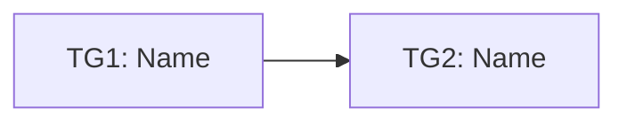

# Dumplink

Use this skill after a project has been framed, shaped, and selected for a fixed time budget. The job is to help a Small Launch Team decompose the shaped project without shredding its intent into disconnected tickets.

Dumplink is for deliberate build-cycle work, not reactive ticket intake. It keeps the project whole while helping the team discover vertical slices of work that can be finished, judged, and shipped within an appetite.

## Goal

Produce a Dumplink plan that shows:

- the raw task dump from the shaped project
- clustered task groups that form vertical slices of shippable behavior
- unknowns, knowns, and done states at the task-group level
- causal dependencies between task groups
- a build sequence that starts with risky and dependency-unlocking work
- possible cuts if the appetite runs out

## Source concept

Dumplink uses three core moves:

1. **DUMP** — list everything the team thinks must happen to build the shaped project.
2. **CLUSTER** — group tasks into isolated vertical task groups that can produce judgeable behavior.
3. **SEQUENCE** — connect task groups by dependency/risk so the team knows what to solve first.

The source tool and concept are from Dumplink: https://github.com/klausbreyer/dump.link and https://dump.link.

## When to use

Use this when:

- a shaped project has been bet on
- the team has an appetite, usually 2–6 weeks
- work is meaningful enough that horizontal task planning would lose the plot
- the team needs to preserve intent while still making implementation concrete
- the next best step is to create vertical slices, not a giant ticket backlog

Do not use this when:

- the work is reactive support, bugs, or interrupt-driven operations
- the problem is still unframed
- no direction has been selected
- the team needs a full technical implementation plan with exact files and code paths

## Inputs

Ask for or infer from available artifacts:

- shaped project pitch or shaping doc
- appetite / time budget
- selected approach and non-goals
- known risks, rabbit holes, and constraints
- breadboard, if available
- existing codebase or implementation context, if available
- acceptance checks or demo target

If the source material is weak, still proceed, but label assumptions.

When a selected slice already exists, it is the hard outer boundary: task groups, dependencies, sequence, and cuts must stay inside it. When no slice has been selected, treat Dumplink groups as planning candidates and stop for a human slice or task-group decision before any build handoff.

## Output

Create these sections:

1. Project boundary
2. Task dump
3. Task groups
4. Unknowns / knowns / done states
5. Dependency map
6. Build sequence
7. Scope cuts
8. Acceptance checks
9. Agent handoff packet

## Method

### 1. Preserve the shaped intent

Start by restating the shaped project in compact form:

- appetite
- target user / operator
- desired outcome
- selected approach
- non-goals
- what must remain true

Do not immediately turn everything into implementation tickets. First preserve the whole.

### 2. Dump tasks

Create an unordered list of likely tasks. Include design, product, data, content, migration, technical, QA, and launch tasks when relevant.

Rules:

- keep tasks rough at first
- do not sequence while dumping
- include unknowns as tasks to investigate
- do not hide design or decision work
- do not over-split into microscopic chores

Use IDs such as `T1`, `T2`, `T3`.

Task table:

| ID | Task | Type | Known/Unknown | Notes |
|---|---|---|---|---|
| T1 |  | product / design / code / data / QA / launch | unknown |  |

### 3. Cluster into task groups

Group tasks by what can be completed together and judged in isolation from the rest.

A good task group:

- produces one judgeable behavior or project state
- cuts vertically through the system when possible
- has clear inputs and outputs
- can be demoed or inspected
- avoids arbitrary categories like frontend/backend/design unless the work truly cannot be sliced vertically

Use IDs such as `TG1`, `TG2`, `TG3`.

Task group table:

| ID | Name | Included tasks | User/system behavior produced | Risk state | Cuttable? | Notes |
|---|---|---|---|---|---|---|
| TG1 |  | T1, T4 |  | unknown / known / done | no |  |

### 4. Mark state by risk, not task count

Track state at the task-group level:

- `not-started` — no meaningful learning or execution yet
- `figuring-it-out` — unknowns remain
- `executing-down` — key unknowns are solved; work is being completed
- `done` — produces the intended behavior and passes acceptance checks
- `cut` — intentionally removed to protect the appetite

The state of a task group is the state of its riskiest important task. Do not let a pile of easy completed tasks hide one unresolved unknown.

### 5. Map dependencies

Draw causal links between task groups. Ask:

- what input does this group need before it can be completed?
- what does this group unlock?
- what unknown could cause rework if found late?
- what group has more outgoing than incoming dependencies?

Dependency table:

| From | To | Why this dependency exists | Risk if delayed |
|---|---|---|---|
| TG1 | TG3 |  |  |

Optional Mermaid:



### 6. Sequence the build

Prefer this order:

1. risk-unlocking task groups
2. dependency-unlocking task groups
3. core user-visible behavior
4. finishing / polish / launch items

Do not start with easy polish if a hidden unknown can sink the project later.

Build sequence table:

| Order | Task group | Why now | Demo/checkpoint | Exit condition |
|---|---|---|---|---|
| 1 | TG1 |  |  |  |

### 7. Identify scope cuts

Variable scope is the point. If the appetite is fixed, define cuts before panic.

For each possible cut, state:

- what is removed
- what still works
- what user/business value remains
- what follow-up decision is needed later

Scope cut table:

| Cut option | Remove/defer | Preserved behavior | Cost of cutting | Later decision |
|---|---|---|---|---|
| C1 |  |  |  |  |

### 8. Write acceptance checks

Acceptance checks should judge behavior at the task-group and project level.

Use checks like:

- A user can complete X end-to-end.
- The system preserves Y state after Z.
- The operator can see whether W is unknown, known, done, or cut.
- The project can ship some version without the cut items.

### 9. Prepare agent handoff

End with a compact handoff packet:

```text
Active slice:
Source artifacts:
Must preserve:
Do not build:
Task group to implement:
Relevant tasks:
Known unknowns:
Acceptance check:
Stop condition:
```

## Quality bar

A good Dumplink output:

- keeps the shaped project whole
- avoids horizontal task silos
- makes vertical slices independently judgeable
- reveals unknowns early
- sequences by risk and dependency, not convenience
- names cuts explicitly
- gives an implementation agent one bounded task group at a time
- never expands an existing selected slice

## Common failure modes

- Turning the shaped project into a flat ticket backlog
- Clustering by discipline instead of shippable behavior
- Treating task count as progress
- Hiding unknowns inside vague engineering tasks
- Sequencing by ease instead of risk
- Deferring dependency-unlocking work too late
- Treating scope cuts as failure instead of appetite discipline
- Feeding an agent the whole project instead of the active task group
- Letting a task group quietly expand an existing selected slice
