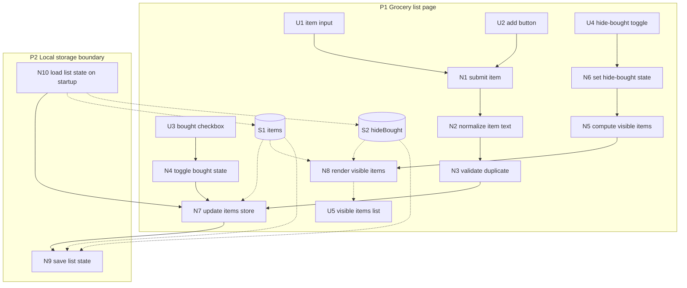

# Simple Grocery List — Breadboard

## Places

| ID | Place | Description |
|----|-------|-------------|
| P1 | Grocery list page | The main screen for adding items, viewing items, toggling bought state, and hiding bought items |
| P2 | Local storage boundary | Persistence layer used to restore and save list state on the same device |

## UI Affordances

| ID | Place | Component | Affordance | Control | Wires Out | Returns To |
|----|-------|-----------|------------|---------|-----------|------------|
| U1 | P1 | add-form | item input | type | → N1 | — |
| U2 | P1 | add-form | add button | click | → N1 | — |
| U3 | P1 | item-row | bought checkbox | click | → N4 | — |
| U4 | P1 | filters | hide-bought toggle | click | → N6 | — |
| U5 | P1 | list-view | visible items list | display | — | ← N8 |

## Non-UI Affordances

| ID | Place | Component | Affordance | Control | Wires Out | Returns To |
|----|-------|-----------|------------|---------|-----------|------------|
| N1 | P1 | add-form | submit item | call | → N2 | — |
| N2 | P1 | item-service | normalize item text | call | → N3 | — |
| N3 | P1 | item-service | validate duplicate | call | → N7 | — |
| N4 | P1 | item-service | toggle bought state | call | → N7 | — |
| N5 | P1 | filter-service | compute visible items | call | → N8 | — |
| N6 | P1 | filters | set hide-bought state | call | → N5 | — |
| N7 | P1 | item-service | update items store | call | → N9 | ← S1 |
| N8 | P1 | list-view | render visible items | call | — | ← S1, S2 |
| N9 | P2 | persistence | save list state | call | — | ← S1, S2 |
| N10 | P2 | persistence | load list state on startup | call | → N7 | → S1, S2 |

## Stores

| ID | Place | Store | Description |
|----|-------|-------|-------------|
| S1 | P1 | items | Array of grocery items with text and `bought` boolean |
| S2 | P1 | hideBought | Boolean controlling whether bought items are filtered from view |

## Mermaid diagram

## Notes

- The chosen shape uses one item store plus a visibility filter, not separate Needed and Bought stores.
- The filter controls display only; it does not change item state.
- Duplicate prevention happens before updating the items store.

## Likely slices

### V1 — Add and persist grocery items
Demo:
- user can add an item
- list restores after reload

Produces:
- persistent item list on the same device

### V2 — Toggle bought state and hide bought items
Demo:
- user can mark items bought/unbought
- user can hide and reveal bought items without deleting them

Produces:
- usable in-store scanning and completion flow
