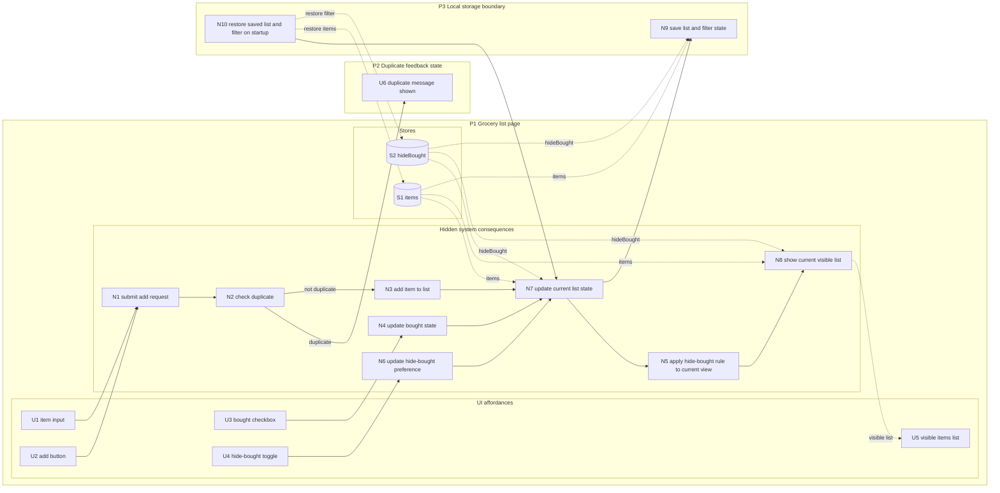

# Simple Grocery List — Breadboard

## Places

| ID | Place | Description |
|----|-------|-------------|
| P1 | Grocery list page | The main place where the user adds items, sees the current list, marks items bought, and controls whether bought items remain visible |
| P2 | Duplicate feedback state | A user-visible state on the grocery list page where the add attempt is rejected because the item already exists |
| P3 | Local storage boundary | Persistence layer used to restore and save list state on the same device |

## UI Affordances

| ID | Place | Component | Affordance | Control | Wires Out | Returns To |
|----|-------|-----------|------------|---------|-----------|------------|
| U1 | P1 | add-form | item input | type | → N1 | — |
| U2 | P1 | add-form | add button | click | → N1 | — |
| U3 | P1 | item-row | bought checkbox | click | → N4 | — |
| U4 | P1 | filters | hide-bought toggle | click | → N6 | — |
| U5 | P1 | list-view | visible items list | display | — | ← N8 |
| U6 | P2 | add-form | duplicate message | display | — | ← N2 |

## Non-UI Affordances

| ID | Place | Component | Affordance | Control | Wires Out | Returns To |
|----|-------|-----------|------------|---------|-----------|------------|
| N1 | P1 | add-form | submit add request | call | → N2 | — |
| N2 | P1 | item-rules | check duplicate | call | → N3, → U6 | — |
| N3 | P1 | item-rules | add item to list | call | → N7 | — |
| N4 | P1 | item-rules | update bought state | call | → N7 | — |
| N5 | P1 | filters | apply hide-bought rule to current view | call | → N8 | — |
| N6 | P1 | filters | update hide-bought preference | call | → N7 | — |
| N7 | P1 | item-state | update current list state | call | → N9, → N5 | ← S1, S2 |
| N8 | P1 | list-view | show current visible list | call | — | ← S1, S2 |
| N9 | P3 | persistence | save list and filter state | call | — | ← S1, S2 |
| N10 | P3 | persistence | restore saved list and filter on startup | call | → N7 | → S1, S2 |

## Stores

| ID | Place | Store | Description |
|----|-------|-------|-------------|
| S1 | P1 | items | Array of grocery items with text and `bought` boolean |
| S2 | P1 | hideBought | Boolean controlling whether bought items are filtered from view |

## Mermaid diagram

This diagram is a rendering of the tables above. The tables remain the source of truth.

## Notes

- The chosen shape uses one item store plus a visibility filter, not separate Needed and Bought stores.
- The filter controls display only; it does not change item state.
- Duplicate checking is shown as a product-relevant hidden rule because it affects whether the user stays on the main list or enters a duplicate-feedback state.
- The center of gravity is place → affordance → visible consequence, with hidden system consequences shown only where they explain product behavior.

## Likely slices

### V1 — Add and persist grocery items
Demo:
- user can add an item
- duplicate add attempts show feedback instead of silently creating a second copy
- list restores after reload

Produces:
- persistent item list on the same device

### V2 — Toggle bought state and hide bought items
Demo:
- user can mark items bought/unbought
- user can hide and reveal bought items without deleting them

Produces:
- usable in-store scanning and completion flow
