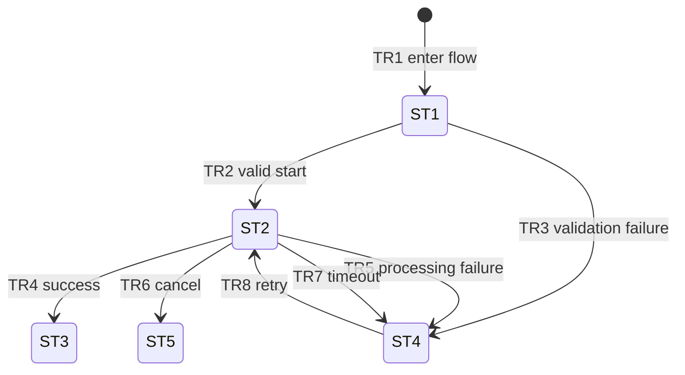

# Background Import — Derived Statechart

## Source

- Breadboard: [`01-accepted-breadboard.md`](./01-accepted-breadboard.md)
- Selected scope: `V1` import job lifecycle

## State inventory

| State ID | Source breadboard IDs | State | Parent state | Meaning | Status |
| --- | --- | --- | --- | --- | --- |
| ST1 | P1, S1 | Ready | — | A file may be selected and an import may start. | explicit |
| ST2 | P2, S2, U5 | Processing | — | A background import is active and reporting progress. | explicit |
| ST3 | P3, S2, U6 | Succeeded | — | The import completed successfully. | explicit |
| ST4 | P3, S2, U4, U6 | Failed | — | Validation, processing, or timeout produced a failure that may be retried. | explicit |
| ST5 | P3, S2, U6 | Canceled | — | The active import was canceled. | explicit |

## Transition table

| Transition ID | From | Trigger type | Event | Guard | Effect | To | Source wiring | Status |
| --- | --- | --- | --- | --- | --- | --- | --- | --- |
| TR1 | `[*]` | automatic | Enter import flow | — | Show import setup | ST1 | P1 | explicit |
| TR2 | ST1 | user | Start import | `N1` says file is valid | Create job and write active status to `S2` | ST2 | U2 → N1 → N2 → S2, P2 | explicit |
| TR3 | ST1 | automatic | Validation fails | `N1` says file is invalid | Show validation failure | ST4 | N1 → P3, U6 | explicit |
| TR4 | ST2 | message | Import completes successfully | completion result is success | Write result to `S2` and show it | ST3 | N4 → S2, P3, U6 | explicit |
| TR5 | ST2 | message | Import completes with error | completion result is failure | Write error to `S2` and show it | ST4 | N4 → S2, P3, U6 | explicit |
| TR6 | ST2 | user | Cancel import | active job exists | Cancel job, write canceled status, show result | ST5 | U3 → N5 → S2, P3, U6 | explicit |
| TR7 | ST2 | time | Import times out | timeout threshold reached | Write timeout failure and show result | ST4 | N6 → S2, P3, U6 | explicit |
| TR8 | ST4 | user | Retry import | selected file still exists in `S1` | Start a new job attempt | ST2 | U4 → N2 → S2, P2 | explicit |

## Mermaid statechart

## Gaps and proposed breadboard updates

| Gap | Missing or ambiguous behavior | Affected breadboard IDs | Recommended breadboard update |
| --- | --- | --- | --- |
| G1 | The destination after success or cancellation is not specified. | P1, P3 | Add an explicit “start another import” affordance or state that the result is terminal for V1. |
| G2 | Retry limits and backoff are unspecified. | U4, N2 | Leave out of V1 as stated, or add explicit policy before implementation if required. |
