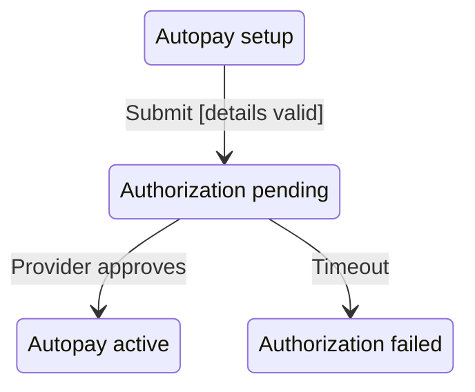

# Statechart

Use this skill when an accepted breadboard contains meaningful state complexity and the team needs a more precise behavioral view before implementation.

## Goal

Derive a bounded statechart from selected breadboard rows so humans and agents can see:

- the meaningful states in scope
- the events that move the system between states
- the conditions that must be true
- the effects that occur
- nested or parallel behavior when it is explicitly supported
- gaps that the breadboard does not yet specify

The output is a derived view. The breadboard tables remain the source of truth.

## Use this when

Use a statechart for a selected scope or slice with behavior such as:

- loading, success, failure, retry, or cancellation
- drafts, review, approval, publication, or archival
- permissions or role-dependent behavior
- timers, deadlines, or timeouts
- background jobs or external messages
- mutually exclusive modes
- several valid actions from the same state
- nested stateful regions that are hard to understand from wiring alone

Do not use this skill for a simple navigation sequence when the breadboard already makes the behavior clear.

## Inputs

Use:

- an accepted breadboard
- the selected scope, place, chunk, or slice to model
- relevant constraints and open questions
- executable-breadboard details when they already exist

Do not derive a statechart from raw notes when no breadboard has been accepted.

## Core rule

```text
Breadboard tables = source of truth
State-transition table = derived behavioral interpretation
Mermaid statechart = visual projection
```

Preserve breadboard IDs. Never silently add behavior to the breadboard.

When the statechart requires an event, guard, effect, or state that is missing from the breadboard:

1. mark it as missing or inferred
2. explain why it matters
3. recommend a breadboard update
4. do not present the inference as selected behavior

## Core concepts

### State

A meaningful condition in which the user or system has a distinct set of possible next actions or outcomes.

A state may come from:

- a place
- a user-visible local state
- a product-relevant store value
- a meaningful waiting condition
- a system lifecycle stage

Do not turn every place, component, or stored field into a state.

### Event

Something that may cause a transition.

Classify the trigger when useful:

- `user` — a person acts
- `automatic` — the system proceeds as soon as conditions are met
- `message` — an external system or asynchronous process responds
- `time` — a deadline, delay, or timeout occurs

### Guard

A condition that must be true before the transition can occur.

Examples:

- payment details are valid
- the current user is an approver
- the request still matches the pending operation

### Effect

The product-relevant consequence of taking the transition.

Examples:

- request authorization
- save the draft
- show the duplicate warning
- mark the job as failed

### Transition

A change from one state to another caused by an event, optionally constrained by a guard and accompanied by an effect.

### Hierarchy

Use parent states only when they make a complex stateful area easier to collapse and understand.

Do not invent hierarchy from visual proximity alone. Ground it in breadboard places, subplaces, chunks, or an explicitly selected scope.

## Procedure

1. Select one bounded breadboard scope or slice.
2. Read the relevant Places, UI Affordances, Non-UI Affordances, Stores, `Wires Out`, and `Returns To` rows.
3. Identify only the states that change what can happen next or what the user can observe.
4. Assign state IDs such as `ST1`, while preserving the source breadboard IDs.
5. Derive transitions from explicit wiring and product-relevant branches.
6. Separate each transition into event, trigger type, guard, effect, and destination state.
7. Add parent states only where the breadboard supports a meaningful hierarchy.
8. Add initial, terminal, retry, cancellation, timeout, and failure states only when explicitly specified, or clearly mark them as missing.
9. Produce the state inventory and transition table before drawing the diagram.
10. Render an optional Mermaid statechart from the tables.
11. List missing behavior, unresolved ambiguity, and any proposed breadboard updates.

## Required output

### Scope

Name the selected breadboard scope or slice and the source artifact.

### State inventory

| State ID | Source breadboard IDs | State | Parent state | Meaning | Status |
| --- | --- | --- | --- | --- | --- |
| ST1 | P2 | Autopay setup | Billing | User is configuring Autopay | explicit |

Use `Status` values:

- `explicit` — directly supported by the breadboard
- `inferred` — reasonable interpretation that requires confirmation
- `missing` — needed for a complete model but absent from the breadboard

### Transition table

| Transition ID | From | Trigger type | Event | Guard | Effect | To | Source wiring | Status |
| --- | --- | --- | --- | --- | --- | --- | --- | --- |
| TR1 | ST1 | user | Submit | Details valid | Request authorization | ST2 | U4 → N4 | explicit |

### Mermaid statechart

Use `stateDiagram-v2` and preserve the state IDs from the inventory.



When imported canonical IDs contain hyphens, Mermaid identifiers may replace them with underscores, but labels and tables must retain the canonical IDs.

### Gaps and proposed breadboard updates

For every unsupported inference, state:

- what is missing
- why it matters
- which breadboard rows should be added or changed

## Quality checks

Before finishing, verify:

- every state maps to one or more breadboard IDs, or is explicitly marked missing
- every transition has valid source and destination states
- every transition names an event
- guards are conditions, not actions
- effects are consequences, not destination states
- important product-visible branches are represented
- asynchronous waits distinguish messages from timeouts when the breadboard specifies them
- retry, cancellation, and failure behavior are not invented
- hierarchy reflects explicit scope, subplaces, or chunks
- the Mermaid diagram matches the state and transition tables
- no statechart output overrides or silently edits the breadboard

## Do not

Do not:

- make statecharts mandatory for every breadboard
- replace the breadboard with the statechart
- create implementation code, SCXML, framework configuration, or production schemas unless explicitly requested
- convert every UI screen into a state without checking whether behavior actually changes
- add parallel states merely because two operations could theoretically happen at once
- hide missing behavior by guessing

## Recommended output structure

```md
# [Project / scope] — Statechart

## Source
- Breadboard:
- Scope or slice:

## State inventory
[table]

## Transition table
[table]

## Mermaid statechart
[diagram]

## Gaps and proposed breadboard updates
- ...
```
