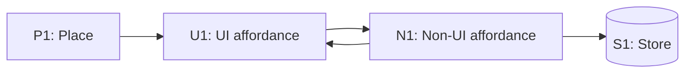

# [Project] — Breadboard

# Context Card

## Use this when
An agent is implementing, slicing, or checking whether code still matches the planned interaction.

## Must preserve
- place IDs
- affordance IDs
- store IDs
- wiring and visible consequences
- selected shape parts
- explicit non-goals

## Ignore unless asked
- rejected shapes
- raw brainstorms
- implementation ideas not tied to an affordance or store

## Source

- Frame: `@planning/frame.md`
- Shaping: `@planning/shaping.md`
- Selected shape: ...

## Places

| ID | Place | Description |
|---|---|---|
| P1 | ... | ... |

## UI Affordances

| ID | Place | Component | Affordance | Control | Wires Out | Returns To |
|---|---|---|---|---|---|---|
| U1 | P1 | ... | ... | ... | → N1 | — |

## Non-UI Affordances

| ID | Place | Component | Affordance | Control | Wires Out | Returns To |
|---|---|---|---|---|---|---|
| N1 | P1 | ... | ... | ... | → S1 | → U1 |

## Stores

| ID | Place | Store | Description |
|---|---|---|---|
| S1 | P1 | ... | ... |

## Product-relevant branches

| Branch | Trigger | Outcome | Visible where? |
|---|---|---|---|
| ... | ... | ... | ... |

## Optional Mermaid diagram

## Slice candidates

| Slice | Demo | Includes | Produces | Depends on | Unknown risk |
|---|---|---|---|---|---|
| SLICE-01 | ... | ... | ... | — | ... |

## Notes

- ...

## Self-check

- [ ] Every displayed UI element depending on data has an incoming source.
- [ ] Every non-UI affordance has Wires Out, Returns To, or both.
- [ ] Product-visible branches are explicit.
- [ ] Stores are modeled when side effects affect future behavior.
- [ ] The diagram, if present, reflects the tables rather than replacing them.
- [ ] Slices end in visible, demoable behavior.
